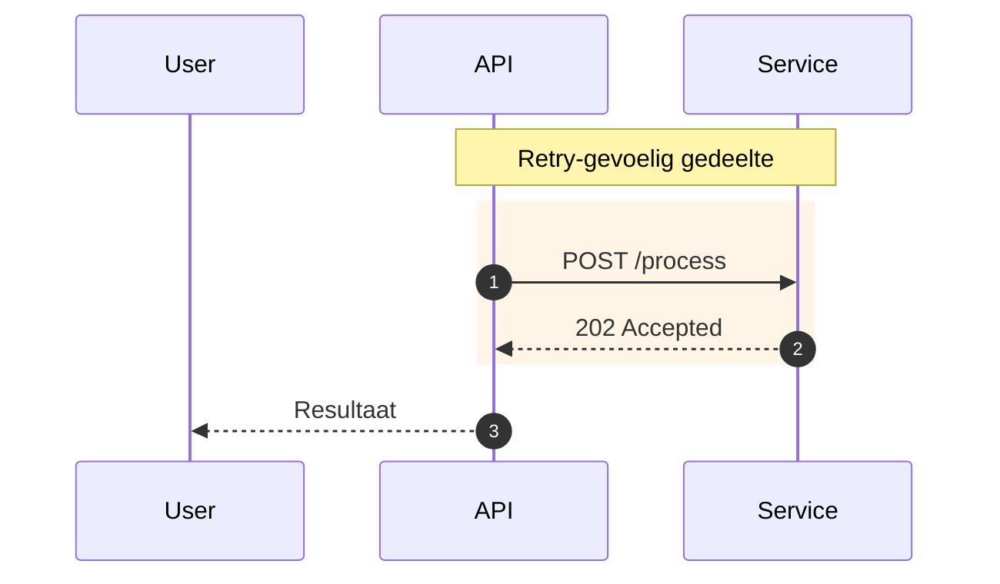

# Niveau 3: Integratieproces sequence diagram

<!-- Handmatig overgenomen vanaf Confluence-pagina "Niveau 3: Integratieproces sequence diagram" (space ACR, page id 908328961), Confluence-versie 36 (laatst bewerkt 2026-06-11), overgenomen op 2026-07-29. Dit bestand is de gedeelde bron voor mulesoft-documentation-skill en frends-documentation-skill; werk het ongeveer maandelijks handmatig bij vanaf Confluence (zie "Architectuur" in beide SKILL.md's) en werk deze regel dan mee bij met de nieuwe datum/versie. -->

# 1. Introductie

Deze pagina beschrijft de standaarden voor het maken van een Mermaid sequence diagram voor integratieprocessen.

We schrijven diagrammen lokaal in VS Code (geen online Mermaid editor i.v.m. dataveiligheid). Bewaar de code in je solution design.

Dit sequence diagram geeft een visuele weergave van het volledige integratieproces, inclusief de interacties tussen verschillende API’s en bijbehorende endpoints. Het diagram maakt zowel de functionele of technische werking van** één specifieke integratie** inzichtelijk. Hierbij wordt duidelijk hoe de verschillende API’s met elkaar communiceren en hoe datastromen binnen de gehele integratie worden verwerkt en afgehandeld.

Dit diagram wordt gemaakt met behulp van **Mermaid**, een tekstgebaseerde diagramtaal. In Mermaid wordt de structuur van een diagram beschreven in code, welke vervolgens automatisch wordt omgezet in een visuele weergave. Dit maakt het mogelijk om diagrammen eenvoudig te onderhouden, aan te passen en te integreren in documentatie.


# 2. Stappenplan: Mermaid Sequence diagram van een integratie maken

Volg de volgende stappen om een Mermaid Sequence diagram van een integratie te maken:

Sommige stappen verwijzen naar een hoofdstuk waar je extra uitleg kunt vinden. 


1. Maak een nieuw .mmd of .md bestand in VS Code. Gebruik de extensies “Mermaid” en “Mermaid Preview” voor syntax en live weergave. Krijg je preview-fouten? Zet de bestandsregelafbreking op LF (niet CRLF). Dit staat beschreven op Mermaid gebruiken in Confluence en VS Code.


1. Controleer of de meest recente **openingsregels ** in het diagram staan diagram 

<https://virtualsciences.atlassian.net/wiki/spaces/ACR/pages/908328961/Niveau+3+Integratieproces+sequence+diagram#3.1.-Openingsregels> 


1. Definieer de start van de flow door een eerste **interactie **tussen een bron-systeem en een API toe te voegen. Kopieer het bijbehorende **sjabloon** en vervang alle invulvelden `<...>` en `[...]` door jouw eigen waarden. Gebruik altijd participanten.

[5. Mermaid Sjablonen](https://virtualsciences.atlassian.net/wiki/spaces/ACR/pages/908328961/Niveau+3+Integratieproces+sequence+diagram#5.-Mermaid-Sjablonen) 

[3.4. Participants](https://virtualsciences.atlassian.net/wiki/spaces/ACR/pages/908328961/Niveau+3+Integratieproces+sequence+diagram#3.4.-Participants)   


1. Voeg vervolgens de **interacties **toe tussen de verschillende systemen (API calls, messaging, responses). Gebruik hiervoor de standaard Mermaid notatie voor requests en responses.

[Niveau 3: Integratieproces sequence diagram | 3.5. Interacties](https://virtualsciences.atlassian.net/wiki/spaces/ACR/pages/908328961/Niveau+3+Integratieproces+sequence+diagram#3.5-Interacties) 


1. Voeg waar nodig** logische blokken** toe om de flow duidelijk weer te geven, zoals iteraties (loop) en conditionele paden (alt/opt).

[Niveau 3: Integratieproces sequence diagram | 5.3. Logische blokken](https://virtualsciences.atlassian.net/wiki/spaces/ACR/pages/908328961/Niveau+3+Integratieproces+sequence+diagram#5.3.-Logische-blokken) 

[Niveau 3: Integratieproces sequence diagram | 5.4. Cheat sheet – wat gebruik je wanneer](https://virtualsciences.atlassian.net/wiki/spaces/ACR/pages/908328961/Niveau+3+Integratieproces+sequence+diagram#5.4.-Cheat-sheet-%E2%80%93-wat-gebruik-je-wanneer) 

1. Gebruik de **juiste pijlen en notatie** om het verschil tussen requests en responses duidelijk te maken.


1. Werk de flow volledig uit tot en met de uiteindelijke response richting het initiële systeem. 


1. Zorg voor duidelijke en consistente naamgeving van systemen, endpoints en responses.


1. Voeg optioneel visuele groepering toe (bijvoorbeeld met rect) om delen van de flow te benadrukken. Voeg ook notes toe over je calls.

[Niveau 3: Integratieproces sequence diagram | 4. Notes en highlights](https://virtualsciences.atlassian.net/wiki/spaces/ACR/pages/908328961/Niveau+3+Integratieproces+sequence+diagram#4.-Notes-en-highlights)

1. Lijn de code uit in kolommen. Dit bevorderd de leesbaarheid.


# 3. Standaard configuratie van het Mermaid diagram

## 3.1. Openingsregels

Om consistentie in de diagrammen te waarborgen, starten de integratie sequence diagrammen met onderstaande standaard configuratie. Deze configuratie zorgt voor een consistente kleurbestelling, goede leesbaarheid en herkenbare stijl. Plaats deze is het begin van je diagram:

```
%%{init: {
    "theme":                        "base",
    "themeCSS":                     "text:not([class]){ text-anchor:middle; transform:translateX(100px);}",
    "themeVariables": {
        "primaryColor":             "#E3EEF7",
        "primaryBorderColor":       "#1592C4",
        "primaryTextColor":         "#1C2E3A",
        "lineColor":                "#1592C4",
        "clusterBkg":               "#F4F9FD",
        "clusterBorder":            "#8CC6E6",
        "sequenceNumberColor":      "#FFFFFF",
        "activationBkgColor":       "#D8EE17",
        "activationBorderColor":    "#000000",
        "fontSize":                 "24px"
    },
    "flowchart": {
        "curve": "monotoneX"
    }
}}%%
```


## 3.2. Diagram definitie

Na de standaard configuratie moet altijd expliciet het **soort **diagram worden gedefinieerd. Dat doe je op de volgende manier:

```
sequenceDiagram
  title Main Flow – (voorbeeldnaam main flow)
```


## 3.3. Autonumber

Gebruik autonumber om per stap een nummer te genereren. Hier kan je dan bijvoorbeeld gemakkelijker naar verwijzen in een presentatie of design. Dit zet je direct na het declareren van het type diagram.

Bijvoorbeeld:

```
sequenceDiagram
  title Main Flow – (voorbeeldnaam main flow)
  autonumber
```

Het is ook mogelijk om een startwaarde en een increment (ophoging per stap) op te geven voor de automatische nummering. Zowel de startwaarde als de increment mogen decimalen bevatten tot op twee cijfers achter de komma.

Gebruik hiervoor de volgende syntax in je diagramdefinitie:

```
autonumber <start> <increment>
```

Bijvoorbeeld:

```
sequenceDiagram
    autonumber 10 5
```

Dit resulteert in nummering als: `10`, `15`, `20`, enzovoort.


## 3.4. Participants

In een sequence diagram werk je niet met nodes zoals in een flowchart, maar met participants en messages.

Participants zijn de systemen of componenten die met elkaar communiceren.

Messages zijn de interacties (API-calls, responses, events) tussen deze participants.

Declareer participants nog voordat je de flow gaat maken expliciet in zo kort mogelijk maar logische afkorting. Bijvoorbeeld:

```
    participant SAP
    participant SAP-SA as sap-sa
    participant DLLVT-EA as dollevoet-ea
    participant WMS
```


## 3.5 Interacties

In een sequence diagram definieer je de communicatie tussen participants met messages. Er zijn verschillende soorten messages, elk met hun eigen betekenis en pijlnotatie.


**Synchrone calls** gebruik je voor request-response interacties waarbij de sender wacht op een antwoord:

```
SAP ->> WMS: createOrder(payload)
WMS -->> SAP: 200 OK
```


**Synchrone calls met activatie** gebruik je als je ook wilt tonen dat een participant actief aan het verwerken is. Dit is de aangeraden notatie wanneer activatie relevant is:

```
SAP ->>+ WMS: createOrder(payload)
WMS -->>- SAP: 200 OK
```

De losse `activate`/`deactivate` syntax is ook mogelijk, maar gebruik bij voorkeur de `+`/`-` shorthand — die houdt de code compacter en de activatie gekoppeld aan de bijbehorende call.


**Asynchrone messages** gebruik je voor fire-and-forget events waarbij de sender niet wacht:

```
SAP -) WMS: orderCreated (event)
```

Labels op messages zijn kort maar informatief: vermeld de operatienaam of het eventtype, en voeg een payload of statuscode toe als die iets toevoegt aan het begrip. Schrijf dus `createOrder(orderId, lines)` of `400 Bad Request` in plaats van alleen `call` of `response`.


**Alternatieve flows** modelleer je met `alt`/`else` voor conditionele logica, `opt` voor optionele stappen, en `par` voor stappen die tegelijkertijd plaatsvinden:

```
alt order valid
    WMS -->> SAP: 200 OK
else validation failed
    WMS -->> SAP: 400 Bad Request
end

opt retry on timeout
    SAP ->> WMS: createOrder(payload)
end

par parallel processing
    SAP ->> WMS: updateStock(payload)
and
    SAP ->> ERP: updateFinance(payload)
end
```

Houd de volgorde van messages consistent met de werkelijke volgorde van uitvoering — van boven naar beneden is tijd vooruit. Vermijd terugwaartse pijlen tenzij het expliciet een callback of async response betreft.


**Activatieblokken** tonen hoe lang een participant actief bezig is met verwerken. Gebruik ze spaarzaam — alleen als de verwerkingstijd conceptueel relevant is:

```
activate WMS
WMS -->> SAP: response
deactivate WMS
```


# **4. Notes en highlights**

Gebruik notes om context of toelichting boven stappen te geven, en highlights (rect) om een reeks interacties visueel te groeperen. Gebruik dit om bepaalde soorten calls te weergeven en toe te lichten

- Plaats notes direct boven de relevante stap(pen).
- Gebruik note over/left/right afhankelijk van positie; meerdere participanten kan met `note over A,B`.
- Highlight een blok met `rect ... end` en houd kleuren binnen ons thema.


Afgesproken kleuren:

-main flow: 235, 245, 255

-uitstapjes: 235, 255, 235

Voorbeeld (zoals wij het toepassen):

```mermaid
%% ─────────────────────────────────────────────
%% Step 6 – Persist the loan order
%% ─────────────────────────────────────────────
note over order_pa,order_sa: Persist the validated loan order in the order system

rect rgb(235, 255, 235)
  order_pa ->>+ order_sa: POST /internal/v1/loanorders
  order_sa -->>- order_pa: 200 ok (order reference)
end
```

Extra voorbeelden:




# 5. Mermaid Sjablonen

Voor elk Mulesoft-component, elke scope en elke trigger is er een **Mermaid-sjabloon** beschikbaar. 

Een sjabloon bevat **invulvelden** die je moet vervangen door je eigen waarden.  
Deze invulvelden zijn herkenbaar aan de notatie:

```
<...> en [...]
```

Wanneer je een sjabloon gebruikt:

1. **Vouw** de gewenste trigger, component of connector open.
2. **Kopieer** het Mermaid-sjabloon.
3. **Plak** het in je Mermaid-diagram.
4. **Vervang alle invulvelden** (inclusief `< >`) door de juiste namen of waarden.


## 5.1. Start interactie

**Mermaid-sjabloon:**

```
[Client] ->>+ [API]: <actie>
```

**Voorbeeld:**

```
[bron-systeem] ->>+ [api-naam]-sa: POST /v1/events/webhook
```

**Mermaid-sjabloon:**

```
[API-1] ->>+ [API-1]: Start processing

Dit eindigen met
[API-1] ->>- [API-1]: End processing
```

**Voorbeeld:**

```
note over dynamicsax-sa: Scheduler
dynamicsax-sa ->>+ dynamicsax-sa: Start processing

Dit eindigen met
dynamicsax-sa ->>- dynamicsax-sa: End processing
```

## 5.2. Interacties

In een sequence diagram worden connectors weergegeven als berichten tussen participants.

**Mermaid notatie: **

```
A ->> B: Request
B -->> A: Response  
```

**Voorbeeld: ** 

```
[api-naam]-sa ->>+ Azure Service Bus: send message naar queue
Azure Service Bus ->>+ [api-naam]-sa: receive message uit queue

[api-naam]-sa ->>+ [extern-systeem]-api: GET /v1/resource
[extern-systeem]-api -->>- [api-naam]-sa: 200 OK
```


## 5.3. Logische blokken

Voor conditionele logica en herhaling gebruik je Mermaid sequence blokken zoals alt, loop en opt.  
Dit wordt bijvoorbeeld gebruikt voor if/else situaties.

**Mermaid-sjabloon:**

```
alt <conditie>
    [A] ->>+ [B]: <actie>
else <alternatief>
    [A] ->>+ [B]: <actie>
end
```

**Voorbeeld:**

```
alt succes
    [api-naam]-sa ->>+ [extern-systeem]-api: POST /v1/orders
    [extern-systeem]-api -->>- [api-naam]-sa: 200 OK
else fout
    [api-naam]-sa ->>+ [extern-systeem]-api: POST /v1/orders
    [extern-systeem]-api -->>- [api-naam]-sa: 500 Error
end
```

**Mermaid-sjabloon:**

```
loop <omschrijving>
    [A] ->>+ [B]: <actie>
end
```

**Voorbeeld:**

```
loop voor elke order
    [api-naam]-sa ->>+ [extern-systeem]-api: POST /v1/orders
    [extern-systeem]-api -->>- [api-naam]-sa: 200 OK
end
```

**Mermaid-sjabloon:**

```
opt <voorwaarde>
    [A] ->>+ [B]: <actie>
end
```

**Voorbeeld:**

```
opt extra validatie
    [api-naam]-sa ->>+ [validatie-service]: POST /validate
    [validatie-service] -->>- [api-naam]-sa: valid
end
```

Wordt gebruikt om parallelle processen weer te geven.

**Mermaid-sjabloon:**

```
par <flow 1>
    [A] ->>+ [B]: <actie>
and <flow 2>
    [A] ->>+ [C]: <actie>
end
```

**Voorbeeld:**

```
par ophalen orders
    [api-naam]-sa ->>+ [orders-api]: GET /orders
    [orders-api] -->>- [api-naam]-sa: 200 OK
and ophalen klanten
    [api-naam]-sa ->>+ [klanten-api]: GET /customers
    [klanten-api] -->>- [api-naam]-sa: 200 OK
end
```

Wordt gebruikt om delen van de flow visueel te groeperen.

**Mermaid-sjabloon:**

```
rect <kleur of label>
    [A] ->>+ [B]: <actie>
end
```

**Voorbeeld:**

```
rect rgb(240, 240, 240)
    [api-naam]-sa ->>+ [extern-systeem]-api: POST /v1/orders
    [extern-systeem]-api -->>- [api-naam]-sa: 200 OK
end
```


## 5.4. Cheat sheet – wat gebruik je wanneer

Gebruik onderstaande richtlijnen bij het kiezen van blokken in een sequence diagram:

**alt**

- Gebruik bij duidelijke splitsing in paden (if/else).  
- Bijvoorbeeld: succes vs fout.

**opt **

- Gebruik voor optionele stappen zonder alternatief pad.  
- Bijvoorbeeld: extra validatie die soms wordt uitgevoerd.

**loop ** 

- Gebruik bij herhaling / iteratie.  
- Bijvoorbeeld: verwerken van een lijst met orders.

**par  **

- Gebruik als acties tegelijkertijd plaatsvinden.  
- Bijvoorbeeld: meerdere API calls parallel uitvoeren.

**rect  **

- Gebruik voor visuele groepering.  
- Bijvoorbeeld: alles wat binnen één systeem of fase gebeurt.

**Algemene richtlijnen:**

- Houd het diagram lineair en leesbaar (van boven naar beneden)  
- Gebruik alt alleen als er echt een alternatief pad is  
- Gebruik opt in plaats van alt zonder else  
- Gebruik loop alleen als het echt iteratie is (niet voor “kan meerdere keren gebeuren”)  


# 6. Pijlen en verbindingen

Gebruik pijlen om het verschil tussen requests, responses en processing weer te geven.

| **Mermaid notatie** | **Gebruik** | **Betekenis** |
| --- | --- | --- |
| `A --> B` | Synchrone call (request) | Start van een synchrone call (request) |
| `B -->> A` | Response / return | Response / return |
| `A ->>+ B` | Start activatie (processing start) | Start van een synchrone call (request) + activatie van de ontvanger |
| `B -->>- A` | Einde activatie | Response / return + einde activatie |

**Voorbeeld Sychrone call:**

```
[api-naam]-sa -->> [extern-systeem]-api: GET /v1/orders
[extern-systeem]-api -->> [api-naam]-sa: 200 OK
```

**Voorbeeld Sychrone + geactiveerde call:**

```
[api-naam]-sa ->>+ [extern-systeem]-api: GET /v1/orders
[extern-systeem]-api -->>- [api-naam]-sa: 200 OK
```


# 7. Opmaak 

## 7.1. Toelichting

Sequence diagrams ondersteunen minder uitgebreide styling dan flowcharts.

Kleuren en stijlen worden voornamelijk toegepast via:

- rect (voor visuele groepering)
- standaard Mermaid thema configuratie

Voorbeeld:

```
rect rgb(235, 255, 235)
    alt succes
        A ->> B: call
    end
end
```

Gebruik bij voorkeur consistente naamgeving en duidelijke labels in plaats van complexe styling.


## 7.2. Standaarden

Gebruik consistente naamgeving voor:

- systemen (bijv. bron-systeem, tussen-systeem, eind-systeem)
- API’s (suffixes zoals -sa, -pa, -ea)
- endpoints (HTTP method + pad)

Houd responses consistent:

- 200 OK
- 202 Accepted
- 4xx/5xx fouten


# 8. Voorbeeld

```
%%{init: {
    "theme":                        "base",
    "themeCSS":                     "text:not([class]){ text-anchor:middle; transform:translateX(100px);}",
    "themeVariables": {
        "primaryColor":             "#E3EEF7",
        "primaryBorderColor":       "#1592C4",
        "primaryTextColor":         "#1C2E3A",
        "lineColor":                "#1592C4",
        "clusterBkg":               "#F4F9FD",
        "clusterBorder":            "#8CC6E6",
        "sequenceNumberColor":      "#FFFFFF",
        "activationBkgColor":       "#D8EE17",
        "activationBorderColor":    "#000000",
        "fontSize":                 "24px"
    },
    "flowchart": {
        "curve": "monotoneX"
    }
}}%%

sequenceDiagram
    autonumber

    participant sugarcrm      as sugarcrm
    participant sugarcrm_ea   as sugarcrm-ea
    participant customer_pa   as customer-pa
    participant sap_sa        as sap-sa
    participant sap           as SAP

    %% ─────────────────────────────────────────────
    %% Inbound event request
    %% ─────────────────────────────────────────────
    sugarcrm ->>+ sugarcrm_ea: POST /v1/events/customers

    %% ─────────────────────────────────────────────
    %% Step 1 – Obtain OAuth2 access token
    %% ─────────────────────────────────────────────
    note over sugarcrm_ea,sugarcrm: Obtain OAuth2 access token from SugarCRM

    rect rgb(235, 245, 255)
        sugarcrm_ea ->>+ sugarcrm: POST /oauth2/token
        sugarcrm -->>- sugarcrm_ea: 200 ok (access token)
    end

    %% ─────────────────────────────────────────────
    %% Step 2 – Fetch account data
    %% ─────────────────────────────────────────────
    note over sugarcrm_ea,sugarcrm: Fetch account data from SugarCRM

    rect rgb(235, 245, 255)
        sugarcrm_ea ->>+ sugarcrm: GET /Accounts
        sugarcrm -->>- sugarcrm_ea: 200 ok (account data)
    end

    %% ─────────────────────────────────────────────
    %% Step 3 – Create customer via customer-pa
    %% ─────────────────────────────────────────────
    note over sugarcrm_ea,customer_pa: Create customer record via customer-pa

    rect rgb(235, 245, 255)
        sugarcrm_ea ->>+ customer_pa: POST /internal/v1/customers/create-customer

        %% ─────────────────────────────────────────────
        %% Step 4 – Forward to SAP adapter
        %% ─────────────────────────────────────────────
        note over customer_pa,sap_sa: Forward customer creation to SAP adapter

        rect rgb(235, 245, 255)
            customer_pa ->>+ sap_sa: POST /internal/v1/customers/create-customer

            %% ─────────────────────────────────────────────
            %% Step 5 – Invoke SAP SOAP service
            %% ─────────────────────────────────────────────
            note over sap_sa,sap: Invoke SAP SOAP service to create customer record

            rect rgb(235, 255, 235)
                sap_sa ->>+ sap: POST /sap/bc/srt/rfc/sap/zmule_customer_createfromdata1/400/zmule_customer_createfromdata1/zmule_customer_createfromdata1
                sap -->>- sap_sa: 200 ok (customer reference)
            end

            sap_sa -->>- customer_pa: 200 ok (customer record)
        end

        customer_pa -->>- sugarcrm_ea: 200 ok (customer created)
    end

    %% ─────────────────────────────────────────────
    %% Outbound response
    %% ─────────────────────────────────────────────
    sugarcrm_ea -->>- sugarcrm: 200 ok
```


# 9. Veelgemaakte fouten

- **Flowchart-concepten gebruiken: **zoals nodes, shapes of classDef
- **Onleesbare namen: **Gebruik duidelijke systeemnamen
- **Geen gebruik van alt/loop: **terwijl er wel logica in zit  
- **Aanhalingstekens **`"`** in een label:** Mermaid gebruikt `"` intern om strings af te bakenen. Een aanhalingsteken in een label breekt de parser.


# 10. Handige tips

- Wil je een enter tussen bepaalde regels? Gebruik:

```
<br/>
```

- Wil je extra toelichting bieden over een actie? Gebruik dan notes. Daarbij heb je 2 smaken.

  **Note over 1 participant:**

  `note over SAP : Response`

  **Note over meerdere participants**

  `note over SAP, WMS : <<names>> are working assumptions<br/>TBD`

  Maar: het gebruik van notes moet beperkt blijven. Daarnaast zijn er in principe geen opmaak-mogelijkheden voor.

Ontbreekt er een sjabloon? Laat het weten aan Floris of Sophie en dan voegen we het toe!
